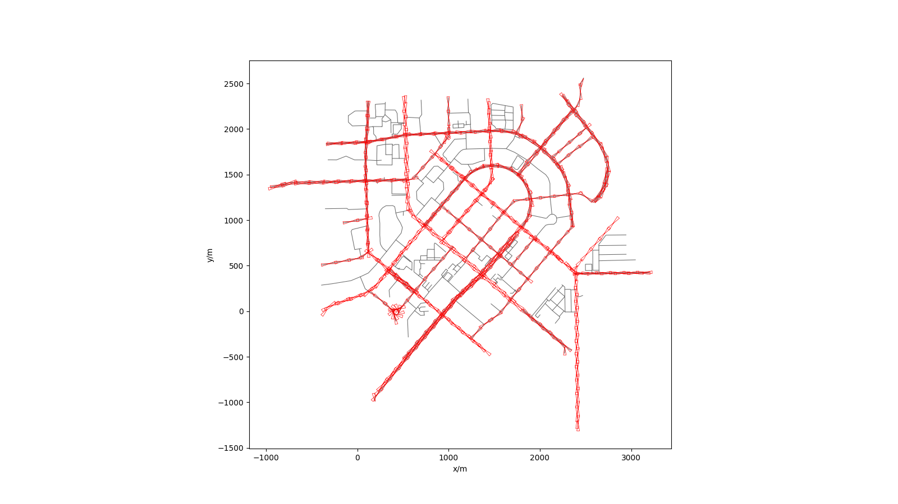

# THICV_Paper

## Introduction
This code is for auto roadside sensor deployment

The input is openstreetmap file, output is the osm file with deployment result

## Install
```bash
pip install -r requirement.txt
```

## Run
```bash
python main.py --config-path path/to/your/config_path --method your_method
```

## Config
The config file is divided into two parts. First is the config/config.cfg, this is for input file path, options for pictures and data process. 
Second is in method module, it includes the params that used for optimize.

## Case
This picture is the result for deployment based on dynamic programming


